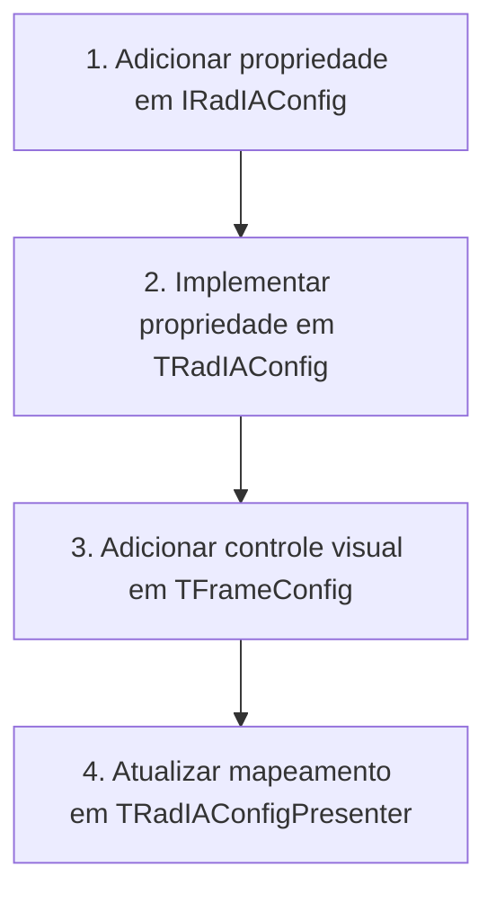

# Guia dos Arquivos Fontes para o Desenvolvedor - Rad IA

Este documento serve como um mapa prático do código-fonte do **Rad IA**. Ele visa guiar novos programadores na navegação e entendimento do repositório, detalhando a responsabilidade de cada unidade (unit) e ensinando como realizar modificações comuns de forma segura e padronizada.

Para entender a arquitetura conceitual em camadas, padrões de projeto aplicados e fluxo concorrente de rede, leia primeiro o [Guia de Arquitetura de Software](architecture_guide.md).

---

## 1. Estrutura de Diretórios e Fluxo de Código

O código-fonte do plugin está concentrado no diretório `Source/` e subdividido de acordo com a responsabilidade arquitetural:

```
Source/
├── Core/           # Regras de negócio centrais, modelos, configurações e utilitários
├── Providers/      # Adaptadores e clientes para provedores de IA (Gemini, OpenAI, etc.)
├── Integration/    # Integração com a IDE Delphi via Open Tools API (OTA)
├── MCP/            # Bridge executável MCP por stdio
└── UI/             # Interfaces com o usuário baseadas em VCL e componentes Web
    └── Web/        # Lógica HTML5/JS/CSS que roda na WebView2 (EdgeBrowser)
```

---

## 2. Dicionário Técnico de Unidades (Units)

### 2.1 Camada Core (`Source/Core/`)
Contém as regras centrais de negócio do Rad IA. É agnóstica à IDE e a componentes de interface visual física.

| Unidade | Propósito Técnico |
| :--- | :--- |
| [RadIA.Core.Interfaces.pas](../../Source/Core/RadIA.Core.Interfaces.pas) | Contratos fundamentais (Interfaces) que desacoplam todas as camadas do plugin. |
| [RadIA.Core.Config.pas](../../Source/Core/RadIA.Core.Config.pas) | Implementação concreta da configuração global (`TRadIAConfig`), gerenciamento de endpoints, tokens e chaves seguras. |
| `RadIA.Core.SettingsStorage.pas` | Contrato `IRadIASettingsStorage`; usa `TRadIARegistrySettingsStorage` em produção e `TRadIAMemorySettingsStorage` nos testes. |
| [RadIA.Core.Container.pas](../../Source/Core/RadIA.Core.Container.pas) | Container IoC estático e thread-safe para injeção de dependência e desacoplamento do ciclo de vida das classes. |
| [RadIA.Core.Service.pas](../../Source/Core/RadIA.Core.Service.pas) | Orquestrador principal (`TRadIAService`). Gerencia sessões de chat, ativação de provedores e caching. |
| [RadIA.Core.InlineCompletion.pas](../../Source/Core/RadIA.Core.InlineCompletion.pas) | Contratos FIM e fallback, discovery por capability, contexto limitado, cache, cancelamento, diagnóstico e controle do Ghost Text. |
| [RadIA.Core.EditorContext.pas](../../Source/Core/RadIA.Core.EditorContext.pas) | Extrai unit, símbolo vigente, imports e declarações próximas para Ghost Text, ações do editor e agente. |
| [RadIA.Core.Sessions.pas](../../Source/Core/RadIA.Core.Sessions.pas) | Lógica de gerenciamento de sessões de chat histórico e persistência automática em arquivos JSON locais. |
| [RadIA.Core.PromptTemplates.pas](../../Source/Core/RadIA.Core.PromptTemplates.pas) | Gerencia o catálogo de prompts reutilizáveis, slash commands e suas substituições dinâmicas de tags. |
| [RadIA.Core.Localizer.pas](../../Source/Core/RadIA.Core.Localizer.pas) | Componente de internacionalização (i18n) para localização dinâmica de strings da interface do usuário. |
| [RadIA.Core.CredentialProtector.pas](../../Source/Core/RadIA.Core.CredentialProtector.pas) | Criptografa e descriptografa chaves de API locais usando a API de Proteção de Dados do Windows (DPAPI). |
| [RadIA.Core.HttpClient.pas](../../Source/Core/RadIA.Core.HttpClient.pas) | Cliente HTTP baseado no `THTTPClient` nativo, especializado no consumo assíncrono e streaming de chunks SSE. |
| [RadIA.Core.ProjectContext.pas](../../Source/Core/RadIA.Core.ProjectContext.pas) | Extrai informações da unit ativa no editor ou de arquivos da estrutura do projeto Delphi atual. |
| [RadIA.Core.ProjectGenerator.pas](../../Source/Core/RadIA.Core.ProjectGenerator.pas) | Lógica para geração de scaffolds e templates estruturais de novos projetos Delphi a partir de prompt. |
| [RadIA.Core.DTO.Generator.pas](../../Source/Core/RadIA.Core.DTO.Generator.pas) | Mecanismo de engenharia reversa para conversão de DDLs SQL e JSON em estruturas de classes Delphi. |
| [RadIA.Core.EditorAdapter.pas](../../Source/Core/RadIA.Core.EditorAdapter.pas) | Interface `IRadIAEditorAdapter` e implementação `TRadIAOTAEditorAdapter` do padrão Adapter para desacoplamento do editor de código da IDE Delphi. |
| `RadIA.Core.Tools` e `ToolRegistry` | Contratos, descritores e registry compartilhado de tools. |
| `RadIA.Core.ToolSecurity` e `WorkspaceBoundary` | Política, auditoria e confinamento de paths. |
| `RadIA.Core.ConsentPresentation` | Origem legível, apresentação uniforme e argumentos sanitizados do consentimento. |
| `RadIA.Core.ConsentGate` | Serializa diálogos e limita a espera de solicitações concorrentes. |
| `RadIA.Core.PseudoTerminal` | Gerencia ConPTY, árvore de processos, resize, entrada UTF-8 e decodificação contínua da saída. |
| `RadIA.Core.TerminalScreen` | Emula VT, Unicode, reflow, cores estendidas, alternate screen, OSC 8, paste e mouse SGR. |
| `RadIA.Core.TerminalEmulator` | Contrato entre UI e emulação VT, inclusive modos negociados, com factory nativa. |
| `RadIA.Core.Workspace*` | Fachada de workspace e tools de editor e projeto. |
| `RadIA.Core.Patches` e `PatchTools` | Preview, precondições, aplicação e reversão de patches. |
| `RadIA.Core.SemanticRefactoringTools` | Rename Symbol exato convertido em preview multiarquivo reversível. |
| `RadIA.Core.TransactionalTextFiles` | Leitura e escrita atômica de arquivos UTF-8 fechados com preservação de BOM e hash-base. |
| `RadIA.Core.Build*` | Contratos e ferramentas do ciclo de build controlado. |
| `RadIA.Core.Designer*` | Facades e tools de componentes, propriedades, eventos e layout. |
| `RadIA.Core.Debugger*` | Estado, controle, breakpoints, avaliação e watches. |
| `RadIA.Core.VisualRuntimeSession` | Sessão visual limitada, vinculada à identidade completa do processo em depuração. |
| `RadIA.Core.RuntimeVisualTools` | Captura consentida anterior/posterior para o card visual local do chat. |
| `RadIA.Core.RuntimeScenario` | Executa o roteiro limitado e publica eventos reais para a timeline visual. |
| `RadIA.Core.Knowledge*` | Indexação, persistência, scheduler, busca e leitura limitada. |
| `RadIA.Core.Mcp` | Protocolo MCP, sessões, cancelamento, métricas e despacho. |
| `RadIA.Core.ExternalMcp` | Contratos e catálogo isolado para consumir servidores MCP externos com namespace estável. |
| `RadIA.Core.ExternalMcpContent` | Catálogos atômicos de resources e prompts com identidade federada. |
| `RadIA.Core.ExternalMcpTransport` | Transporte JSONL stdio limitado, com processo isolado, timeout e encerramento da árvore. |
| `RadIA.Core.ExternalMcpClient` | Lifecycle JSON-RPC, correlação, tools e cancelamento ativo por ID. |
| `RadIA.Core.ExternalMcpSecurity` | Concessões, política comum, consentimento, auditoria e validação de paths. |
| `RadIA.Core.ExternalMcpSettings` | Snapshot MCP validado, protegido por usuário e persistido atomicamente. |
| `RadIA.Core.ExternalMcpRuntime` | Carrega snapshots protegidos, conecta servidores habilitados, descobre conteúdo, registra somente adapters concedidos e publica saúde sanitizada sem restart. |
| `RadIA.Core.ExternalMcpImport` | Importa `mcpServers`/`servers` como preview validado e atômico, sem executar ou persistir durante o parsing. |
| `RadIA.Core.HierarchicalSettings` | Valores, origens e precedência entre requisição, sessão, projeto, global e padrão seguro. |
| `RadIA.Core.HierarchicalSettingsStore` | Persistência JSON atômica de escopos, com nomes protegidos por hash e preservação de campos desconhecidos. |
| `RadIA.Core.AgentExecutorContracts` e `AgentExecutors` | Capacidades, retomada e execução isolada dos clientes CLI externos. |
| `RadIA.Core.JourneyContext` | Identidade compartilhada e isolada por projeto entre chat, terminal e editor. |
| `RadIA.Core.BlockReviews`, `BlockReviewSessions` e `BlockReviewTools` | Decisões por bloco, revisão-base e aplicação transacional pelo gutter. |
| `RadIA.Core.DeclarativeExtensions` | Parser, validação e hot reload de comandos, skills, aliases, jornadas e workflows. |
| `RadIA.Core.DeclarativeExtensionPackages` | Integridade, instalação e rollback transacional de pacotes e recursos `.radiaext`. |
| `RadIA.Core.ExtensionStudio` | Draft, preview e validação usados pelo editor visual de extensões. |
| `RadIA.Core.SkillPortability` | Modelo canônico e adaptadores de formato e path para skills de CLI. |
| `RadIA.Core.SkillReplicas` | Preview, hashes de propriedade, gravação atômica, rollback e remoção segura. |
| `RadIA.Core.Extensions` | API versionada e ciclo de registro de extensões. |
| `RadIA.Core.GeneratedArtifacts` | Previews com hash, aplicação consentida e reversão segura de artefatos gerados. |
| `RadIA.Core.ProductivityGeneration*` | Geração determinística de `API.md` e mocks a partir do índice semântico. |
| `RadIA.Core.StackTrace*` | Importação limitada e correlação multiarquivo de traces Delphi, MadExcept e EurekaLog. |
| `RadIA.Core.SaveReview` | Análise limitada usada pela revisão opt-in executada em background após o save. |
| `RadIA.Core.CleanUses*` | Preview semântica conservadora para remoção reversível de imports sem uso. |

### 2.2 Camada de Provedores (`Source/Providers/`)
Encapsula a comunicação HTTP específica com cada provedor de Inteligência Artificial.

| Unidade | Propósito Técnico |
| :--- | :--- |
| [RadIA.Provider.Base.pas](../../Source/Providers/RadIA.Provider.Base.pas) | Classe ancestral abstrata (`TRadIAProviderBase`) que padroniza o ciclo de vida e requisições assíncronas. |
| [RadIA.Provider.Gemini.pas](../../Source/Providers/RadIA.Provider.Gemini.pas) | Integração nativa com a API do Google Gemini (incluindo parsing de stream e chat history). |
| [RadIA.Provider.GithubCopilot.pas](../../Source/Providers/RadIA.Provider.GithubCopilot.pas) | Adaptador para conexão segura, login por dispositivo (OAuth) e consumo das APIs do GitHub Copilot. |
| [RadIA.Provider.Ollama.pas](../../Source/Providers/RadIA.Provider.Ollama.pas) | Cliente local Ollama, incluindo FIM dedicado por `/api/generate`. |
| [RadIA.Provider.Claude.pas](../../Source/Providers/RadIA.Provider.Claude.pas) | Conector específico para a API Anthropic Claude. |
| [RadIA.Provider.LMStudio.pas](../../Source/Providers/RadIA.Provider.LMStudio.pas) | Conector local LM Studio, incluindo FIM dedicado por `/v1/completions`. |
| [RadIA.Provider.DeepSeek.pas](../../Source/Providers/RadIA.Provider.DeepSeek.pas) | Adaptador para consumo dos modelos DeepSeek Chat e Coder. |
| [RadIA.Provider.AzureOpenAI.pas](../../Source/Providers/RadIA.Provider.AzureOpenAI.pas) | Integração corporativa com endpoints do Azure OpenAI Service. |

### 2.3 Camada de Integração (`Source/Integration/`)
Usa as APIs de extensão da IDE Delphi (**Open Tools API - OTA**) para acoplar os painéis visuais e monitorar o editor de código.

| Unidade | Propósito Técnico |
| :--- | :--- |
| [RadIA.OTA.Register.pas](../../Source/Integration/RadIA.OTA.Register.pas) | Ponto de entrada do plugin. Registra o Wizard principal na IDE (`TRadIAWizard`) e inicializa o container IoC. |
| [RadIA.OTA.EditorHook.pas](../../Source/Integration/RadIA.OTA.EditorHook.pas) | Hook interceptador de ações. Gerencia menus de contexto do botão direito do mouse no editor de código da IDE. |
| [RadIA.OTA.ContextParser.pas](../../Source/Integration/RadIA.OTA.ContextParser.pas) | Extrai e normaliza código-fonte do editor de texto para enviar como contexto em prompts da IA. |
| [RadIA.OTA.DockableForm.pas](../../Source/Integration/RadIA.OTA.DockableForm.pas) | Adaptador `INTACustomDockableForm` que entrega à OTA a criação do host, o docking e a persistência no desktop da IDE. |
| [RadIA.OTA.Helper.pas](../../Source/Integration/RadIA.OTA.Helper.pas) | Encapsula funções utilitárias complexas para manipulação de texto no editor, consumindo o editor ativo via `IRadIAEditorAdapter`. |
| [RadIA.OTA.MessageViewHook.pas](../../Source/Integration/RadIA.OTA.MessageViewHook.pas) | Intercepta e gerencia os itens de erros e avisos da aba "Messages" para habilitar o Smart Build Debugger. |
| `RadIA.OTA.Workspace` e `TextReader` | Fachada OTA de workspace e leitura segura de buffers. |
| `RadIA.OTA.Consent` | Diálogo nativo e decisões de ferramentas mutáveis. |
| `RadIA.OTA.Build` | Adapter do build e captura estruturada de resultados. |
| `RadIA.OTA.Designer` | Adapter do Form Designer vivo na thread principal. |
| `RadIA.OTA.Debugger` | Adapter de estado e controle do debugger. |
| `RadIA.OTA.RuntimeDiscovery` | Descoberta autorizada de janelas e captura PNG limitada do processo em depuração. |
| `RadIA.OTA.InlineCompletion` | Captura de contexto e integração do Ghost Text e de suas alternativas com o editor vivo. |
| `RadIA.OTA.InlineReviews` | Apresentação e ciclo das revisões inline pela API moderna `INTACodeEditorEvents`. |
| `RadIA.OTA.Knowledge*` | Índice local e notificações de edit, save, rename e close. |
| `RadIA.MCP.NamedPipe` | Servidor local, ACL, discovery por PID e transporte. |

### 2.4 Bridge MCP (`Source/MCP/`)

| Unidade | Propósito Técnico |
| :--- | :--- |
| `RadIA.MCP.Bridge.dpr` | Bridge stdio que descobre a IDE e encaminha MCP ao named pipe local. |

### 2.5 Camada de Interface do Usuário (`Source/UI/`)
Formulários e quadros visuais VCL desenvolvidos sob o padrão MVP (Model-View-Presenter).

| Unidade | Propósito Técnico |
| :--- | :--- |
| [RadIA.UI.ChatFrame.pas](../../Source/UI/RadIA.UI.ChatFrame.pas) | View física do painel de chat. Contém o componente WebView2 e campos de entrada de prompt. |
| [RadIA.UI.ChatPresenter.pas](../../Source/UI/RadIA.UI.ChatPresenter.pas) | Presenter do chat. Coordena o envio, cancelamento, renderização de stream e histórico de mensagens. |
| [RadIA.UI.ConfigFrame.pas](../../Source/UI/RadIA.UI.ConfigFrame.pas) | View física das opções de configuração (chaves de API, endpoints, temas, limites). |
| [RadIA.UI.ConfigPresenter.pas](../../Source/UI/RadIA.UI.ConfigPresenter.pas) | Presenter de configurações. Carrega e salva as opções de forma síncrona. |
| [RadIA.UI.DiffForm.pas](../../Source/UI/RadIA.UI.DiffForm.pas) | Tela de visualização lado a lado (Smart Diff) com botões para aceitar ou recusar a refatoração sugerida. |
| `RadIA.UI.TerminalFrame` e `TerminalTabsFrame` | ConPTY, abas, perfis, histórico e renderer TUI com links sob consentimento. |
| `RadIA.UI.ExternalMcpFrame` | Cadastro, teste, grants e aplicação da configuração de servidores MCP externos. |
| `RadIA.UI.ExtensionStudioForm` | Criação visual, teste, instalação, exportação e assinatura de extensões declarativas. |
| `RadIA.UI.SkillPortabilityForm` | Seleção de destinos, preview, consentimento, publicação e remoção de réplicas. |


---

## 3. Fluxos de Manutenção Prática

### 3.1 Adicionando um Novo Campo de Configuração
Se você precisa salvar e expor uma nova opção de configuração para o usuário (por exemplo, "Temperatura do Modelo"):



1.  **Interface de Configuração**: No arquivo [RadIA.Core.Interfaces.pas](../../Source/Core/RadIA.Core.Interfaces.pas), declare os métodos de leitura e escrita na interface `IRadIAConfig`:
    ```pascal
    function GetModelTemperature: Double;
    procedure SetModelTemperature(const AValue: Double);
    property ModelTemperature: Double read GetModelTemperature write SetModelTemperature;
    ```
2.  **Implementação de Persistência**: Em [RadIA.Core.Config.pas](../../Source/Core/RadIA.Core.Config.pas), implemente os métodos. Use a instância `FStorage` para gravar as informações no Registro:
    ```pascal
    function TRadIAConfig.GetModelTemperature: Double;
    begin
      Result := FStorage.ReadDouble('ModelTemperature', 0.7); // 0.7 é o valor padrão
    end;

    procedure TRadIAConfig.SetModelTemperature(const AValue: Double);
    begin
      FStorage.WriteDouble('ModelTemperature', AValue);
    end;
    ```
3.  **Adicionar na Interface Gráfica**:
    *   Abra o frame de configurações [RadIA.UI.ConfigFrame.dfm](../../Source/UI/RadIA.UI.ConfigFrame.dfm) no Delphi IDE.
    *   Insira um controle visual adequado (ex: `TEdit` ou `TComboBox`) e dê um nome padrão (ex: `edtModelTemperature`).
    *   No arquivo `.pas` correspondente, declare a propriedade correspondente na interface `IRadIAConfigView` para expor o valor ao Presenter.
4.  **Sincronizar no Presenter**: No arquivo [RadIA.UI.ConfigPresenter.pas](../../Source/UI/RadIA.UI.ConfigPresenter.pas), modifique os métodos de sincronização:
    *   No método `LoadSettings`, carregue do Model para a View:
        `FView.ModelTemperature := FConfig.ModelTemperature;`
    *   No método `SaveSettings`, salve da View para o Model:
        `FConfig.ModelTemperature := FView.ModelTemperature;`

### 3.2 Modificando a Interface Web do Chat (WebView2)
A interface de chat é desenhada localmente usando arquivos web empacotados. Toda a lógica HTML/JS do chat fica no subdiretório `Source/UI/Web/`.

*   **HTML Principal**: [chat.html](../../Source/UI/Web/chat.html) (Contém a estrutura visual e o container do chat).
*   **Folhas de Estilo**: [chat.css](../../Source/UI/Web/chat.css) (Controla o layout base do chat) e [chat-theme.css](../../Source/UI/Web/chat-theme.css) (Controla as variáveis de cores para os temas Light/Dark adaptados da IDE).
*   **Lógica JS**: [chat.js](../../Source/UI/Web/chat.js) (Controla a renderização de mensagens, markdown e eventos de interface do chat) e [bridge.js](../../Source/UI/Web/bridge.js) (Implementa o canal de comunicação de ponte de dados entre a BPL e a WebView2).

> [!IMPORTANT]
> Toda modificação nos arquivos Javascript ou de layout web localizados em `Source/UI/Web` exige a execução do linter para certificar-se de que não há bugs de sintaxe. Na raiz do projeto, execute:
> ```bash
> npx eslint
> ```
> O instalador automatizado (`build.ps1`) se encarrega de sincronizar estes arquivos para `%APPDATA%\RadIA\Web` no deploy local para que a IDE os localize.

---

## 4. Regras Técnicas de Object Pascal para Modificações de Fontes

Ao trabalhar nesta base de código, você deve se atentar estritamente às seguintes restrições do compilador do Delphi:

### 4.1 Evitando o Limite de 255 Caracteres de String Literais (Erro E2056)
O compilador do Delphi (especialmente em versões de 32-bit usadas na IDE) falha ao compilar blocos contínuos de strings com mais de 255 caracteres dentro de aspas simples.
*   **Incorreto**:
    ```pascal
    LPrompt := 'Esta é uma instrução excessivamente longa de prompt que facilmente ultrapassará o limite permitido pelo compilador Delphi se não for adequadamente quebrada com concatenações explícitas em tempo de compilação...';
    ```
*   **Correto**:
    ```pascal
    LPrompt := 'Esta é uma instrução excessivamente longa de prompt que ' +
               'facilmente ultrapassará o limite permitido pelo compilador ' +
               'Delphi se for adequadamente quebrada com concatenações.';
    ```

### 4.2 Gerenciamento Manual de Memória e try..finally
O Delphi não possui Garbage Collector para instâncias de classes. Sempre que criar uma instância local de um objeto, garanta sua destruição segura com blocos de proteção:
```pascal
LList := TStringList.Create;
try
  // Executa processamento na lista
finally
  LList.Free; // Libera a memória alocada mesmo se ocorrer uma exceção anterior
end;
```
*   *Nota*: Sempre dê preferência ao método `.Free`. Use `FreeAndNil(LVar)` somente se a variável local puder ser reutilizada ou consultada como `Assigned(LVar)` após a desalocação.

### 4.3 Thread-Safety nas Telas da IDE
Operações HTTP de streaming rodam em threads secundárias (`TTask`). Como a VCL e o motor WebView2 não são thread-safe, **nunca** atualize elementos visuais diretamente de dentro da thread de background.
*   **Incorreto**:
    ```pascal
    TTask.Run(procedure
    begin
      FWebBrowser.Navigate(LUrl); // Erro de thread na VCL!
    end);
    ```
*   **Correto**:
    ```pascal
    TTask.Run(procedure
    begin
      // Executa chamada HTTP de background...
      TThread.Queue(nil,
        procedure
        begin
          FView.AppendMessage('user', LResponseText); // Executa de forma segura na thread principal
        end);
    end);
    ```

### 4.4 Ciclo de Vida da WebView2 no Shutdown da IDE
Ao fechar a IDE do Delphi, o motor WebView2 (`TEdgeBrowser`) pode gerar deadlocks COM graves se destruído de forma síncrona pela VCL.
*   Ao criar instâncias dinâmicas do `TEdgeBrowser`, sempre passe `nil` como Owner:
    `FEdgeBrowser := TEdgeBrowser.Create(nil);`
*   No destrutor `Destroy` de qualquer formulário que contenha a WebView2, verifique o estado da flag global `GIsShuttingDown` (localizada em `RadIA.Core.Types.pas`):
    ```pascal
    if not GIsShuttingDown then
    begin
      if Assigned(FEdgeBrowser) then
        FreeAndNil(FEdgeBrowser);
    end
    else
    begin
      if Assigned(FEdgeBrowser) then
        FEdgeBrowser.Parent := nil; // Desassocia visualmente sem forçar liberação COM síncrona
    end;
    ```

---

## 5. Sincronização do workspace semântico

`RadIA.OTA.SemanticWorkspace.pas` captura na thread principal somente dados permitidos pela OTA:
projeto ativo, demais projetos do grupo, buffers abertos e perfil efetivo do compilador. As fontes
instaladas de RTL/VCL recebem escopos separados. O conteúdo não salvo do editor tem precedência
sobre o arquivo em disco.

`RadIA.Semantic.Workspace.pas` compara fingerprints por unit e envia ao processo externo somente
arquivos novos ou alterados. Leitura de disco, parsing e atualização do índice acontecem em
background. Units removidas saem de todos os lookups; se o processo reiniciar, o snapshot completo
é reenviado. Não acesse `ToolsAPI` no worker nem implemente resolução semântica na BPL.

## 6. Validar o corpus do motor semântico

O processo `RadIA.Semantic.Engine.exe` deve ser compilado antes da validação. Os comandos abaixo
analisam todas as units Pascal disponíveis nas pastas `source/rtl` e `source/vcl` da instalação
correspondente:

```powershell
powershell.exe -ExecutionPolicy Bypass -File build.ps1 -DelphiVersion "23.0"
npm run test:semantic-corpus:12
npm run test:semantic-completion:12
npm run test:semantic-members:12

powershell.exe -ExecutionPolicy Bypass -File build.ps1 -DelphiVersion "37.0"
npm run test:semantic-corpus:13
npm run test:semantic-completion:13
npm run test:semantic-members:13
```

O gate exige cobertura exata de offsets em 100% dos arquivos, parsing estrutural de pelo menos 99%,
spans válidos e exatamente um módulo por unit. Um oráculo lexical independente localiza declarações
estruturais ancoradas por `type` na interface e exige que cada uma possua um símbolo correspondente no
parser. Assim, uma árvore incompleta não pode ser aceita apenas porque o parser não diagnosticou a si
mesmo. O relatório reproduzível é gravado em `Output/Evidence`, fora da documentação de usuário.

O corpus de completion indexa as mesmas RTL/VCL e deriva pontos determinísticos de membros declarados
em tipos de nome não ambíguo. Cada consulta deve retornar `status` e `reason`, resolver ao menos um
candidato compatível com o prefixo e nunca produzir resposta silenciosa. O relatório inclui quantidade
de arquivos, pontos avaliados, candidatos e latências P50, P95 e máxima por versão do Delphi.

Os probes de membros ausentes exercitam regras reais da linguagem: assinaturas básicas, sobrecargas,
herança de interfaces, implementação fornecida por uma classe-base e contratos condicionais. Cada caso
deve produzir exatamente os membros esperados, permanecer idempotente na segunda execução, compilar
com o `dcc32` da versão avaliada e executar as chamadas pelo contrato de interface sem falhar. O
compilador e o despacho real da interface funcionam como oráculos externos da edição proposta.

O mesmo comando compila duas aplicações VCL representativas, valida a identidade entre a classe raiz
do DFM e a classe Pascal e resolve eventos do formulário contra métodos reais. Também analisa snapshots
de buffers interrompidos antes de `implementation` e exige que declarações estáveis já digitadas
continuem disponíveis. Isso cobre projetos, formulários e o estado transitório normal do editor.
